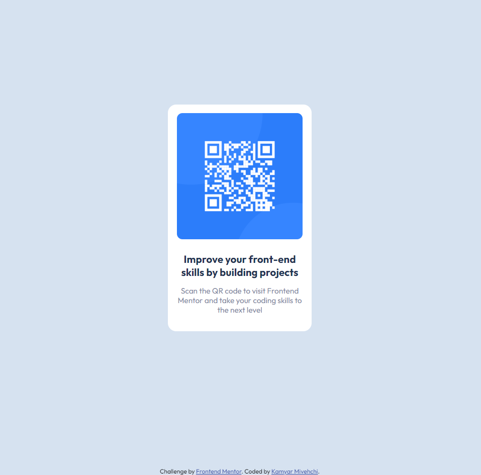

# Frontend Mentor - QR code component solution

This is a solution to the [QR code component challenge on Frontend Mentor](https://www.frontendmentor.io/challenges/qr-code-component-iux_sIO_H). Frontend Mentor challenges help you improve your coding skills by building realistic projects. 

## Table of contents

- [Frontend Mentor - QR code component solution](#frontend-mentor---qr-code-component-solution)
  - [Table of contents](#table-of-contents)
  - [Overview](#overview)
    - [Screenshot](#screenshot)
    - [Links](#links)
  - [My process](#my-process)
    - [Built with](#built-with)
    - [What I learned](#what-i-learned)
    - [Continued development](#continued-development)
  - [Author](#author)

## Overview

### Screenshot

### Links

- Solution URL: [Frontendmentor.io](https://www.frontendmentor.io/solutions/qrcodecomponent-TiqLkiPB5L)
- Live Site URL: [Github Pages](https://kam-mivehchi.github.io/qr-code-component/)

## My process

### Built with

- Semantic HTML5 markup
- CSS custom properties
- Flexbox
- CSS Grid

### What I learned

Learned how to resize an image based on the parent container by utilizing margin and padding. Additionally learned how the cascading nature of CSS can be used to reduce overall file size.

### Continued development

Build this component in the react framework utilizing props for the image, heading, text content and font colors

## Author

- Website - [Kamyar Mivehchi](https://www.kamyarmivehchi.com)
- Frontend Mentor - [@Kam-Mivehchi](https://www.frontendmentor.io/profile/Kam-Mivehchi)

